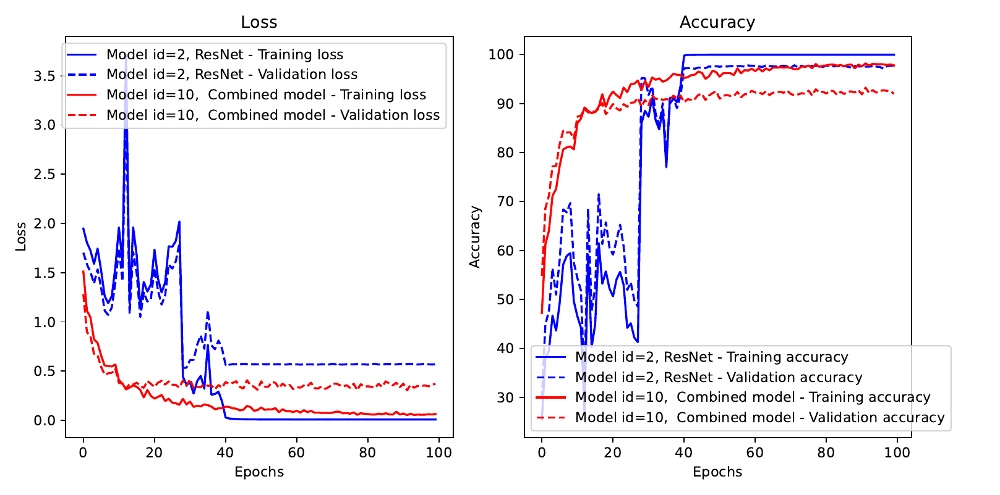
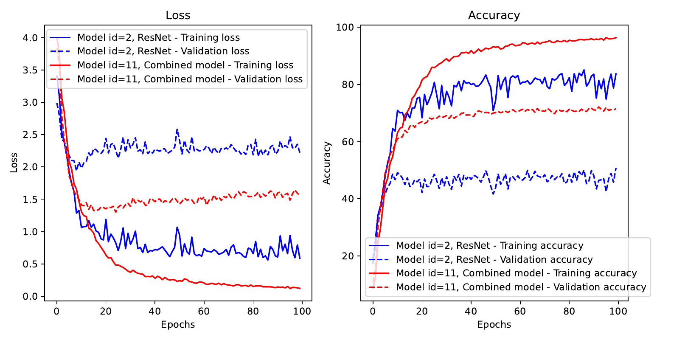

Project work for DD2424 @ KTH

Group name in Canvas:
Project Groups 30

Project:
Default Project 2 - Building and Training a modern ConvNet from scratch

Description of project is provided in `DefaultProject2.pdf`

# How to run the code?
Please install all the packages in the provided requirements.txt with `python -m pip install -r requirements.txt`

The code is ran with `python main.py [arguments_go_here]`. To see a full list of arguments please use `python main.py [-h/--help]`.

# Results
## CIFAR-10
### Loss plot

### Predictions visualized

## CIFAR-100
### Loss plot

### Predictions visualized

